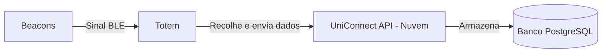

# UniConnect - Documentação do Projeto

## 📌 Visão Geral

O UniConnect é uma aplicação desenvolvida em **ASP.NET Core**, com banco de dados **PostgreSQL**, oferecendo recursos de upload, análise e gestão inteligente de dados. A aplicação já está em produção na nuvem.

## 🏗️ Arquitetura & Fluxo de Dados

A solução utiliza dispositivos Beacons e Totens que se comunicam com a API UniConnect hospedada na nuvem. A API processa e armazena os dados no PostgreSQL.

### 📡 Fluxo simplificado:

O **UniConnect** é uma aplicação desenvolvida com o objetivo de facilitar a gestão e análise de contratos, oferecendo recursos de upload de documentos (PDF/Word), extração automática de dados, armazenamento estruturado em banco de dados e visualização dos resultados por meio de dashboards.

## ✨ Principais Funcionalidades

* Upload de documentos e dados
* Extração automática e inteligência na análise
* Interface moderna e responsiva para visualização de resultados
* Comunicação com dispositivos Beacons e Totens
* Armazenamento seguro em banco PostgreSQL na nuvem

## 🚀 Objetivos do Projeto

O UniConnect foi criado para entregar uma plataforma moderna de gerenciamento e integração de informações corporativas, garantindo:

* Mais velocidade na tomada de decisão
* Redução de processos manuais
* Monitoramento inteligente de informações
* Confiabilidade e centralização de dados

## 🧩 Tecnologias Utilizadas

* **ASP.NET Core** — API robusta, performática e escalável
* **PostgreSQL** — Banco de dados relacional na nuvem
* **Mermaid** — Diagramas e documentação visual integrada
* **Infra na Nuvem** — Alta disponibilidade, acesso remoto e segurança

## 🌐 Status do Projeto

⚡ Já está publicado em ambiente de produção na nuvem

## 📌 Imagens e Diagramas

> *Este espaço será utilizado para inserir capturas da interface, sistemas e novos fluxos visuais em andamento.*

---

📍 *Este README está em constante evolução conforme novas funcionalidades são lançadas.*
